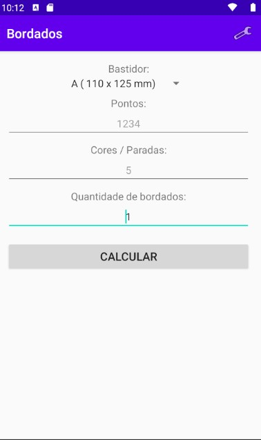
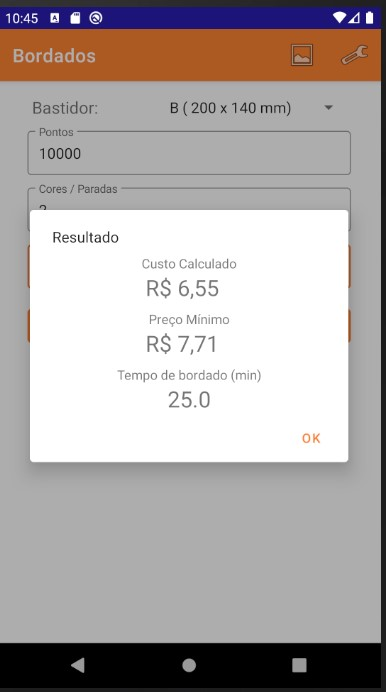
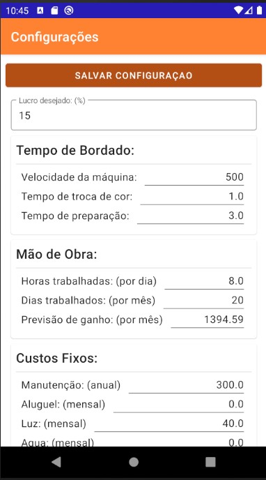
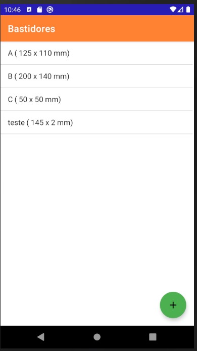

# Projeto Sem nome

Aplicativo android para calculo de valor de bordado partindo da entrada de valores pelo usuário de quantidade de cores e numero de pontos e apresentando uma estimativa de custos e valor minimo que deve ser cobrado.

## Telas

### Inicial

Campos de entrada:

- Tamanho do bastidor;
- Quantidade de pontos da matriz;
- Quantidade de cores do bordado;
- Quantidade de bordados por peça;

### Tela de resultado

- Custo calculado;
- Preço sugerido;
- Tempo de produção;

### Tela de configuração

- Tempo de bordado
  - Velocidade da maquina
  - tempo de troca de cor
  - tempo de preparação

- Lucro desejado

- Custos de material:
  - Linha bordado
    - Custo do cone
    - Quantidade de linha por cone
    - Consumo de linha por 1000 pontos (6.5)
  - Linha bobina
    - Custo do cone
    - Quantidade de linha por cone
    - Consumo de linha por 1000 pontos (2.5)
  - Entretela
    - Custo (do metro)
    - largura
    - comprimento (sempre 1 metro?)

- Mão de obra (valor da hora trabalhada):
  - Numero de horas trabalhadas (por dia)
  - Numero de dias trabalhados (por mês)
  - Previsão de ganho (Salário, Calculado ou informado)

- Custos fixos:
  - Aluguel
  - Luz
  - Agua
  - Telefone / Internet
  - Manutenção (valor anual)

### Tela CRUD Bastidores

> Em definição

## Tecnologias

- Android:
  - Kotlin
  - SQLite
  - ROOM lib

Ferramentas:

- Android Studio
  - versão minima 4.4
  - versão 10 do android;

----

## Passos para Publicação

Lista de Verificação de lançamento: [ver](https://developer.android.com/distribute/best-practices/launch/launch-checklist?hl=pt-br)

Cinco tarefas principais para preparar o aplicativo para lançamento:
- Preparar materiais para publicação:
  - [ ] EULA;
  - [ ] Chaves criptográficas;
  - [ ] Nome para o App;
  - [ ] Criar um ícone e imagens para loja;
  - [ ] Preparar textos promocionais e criar capturas de tela do aplicativo;
- Configurara aplicação para publicação;
- Compilar aplicação;
- ~~Preparar servidores/APIs necessárias~~;
- Testar aplicação;

----

## Ideias de melhoria

- [ ] Levar em consideração a depreciação da maquina nos custos fixos; [ddauriol](https://www.twitch.tv/ddauriol)
  - [ ] Adicionar tela de gerenciamento de máquinas;
  - [ ] Adicionar cálculos referentes a depreciação;
- [ ] Adicionar valor de referência de preços mínimos de bordado (tabela de ref);
- [ ] Adicionar uma tela com cálculos salvos de bordados;
  - [ ] ver a possibilidade de adicionar foto/imagem do bordado;
- [ ] pensar se faz sentido criar uma API para persistir as configurações e bordados salvos na nuvem ou criar uma backup em arquivo e/ou enviar para google drive;

----

## Próximos Passos

### Release 0.1.0

- ...

### Pré-release

- [X] ~~Definir tela de resultado do cálculo;~~
- [X] ~~Acessar dados do Database para popular os editTexts da tela de configuração;~~
- [X] ~~Acessar os dados do Database para fazer o cálculo na tela inicial;~~
- [X] ~~Salvar as alterações de configuração na base de dados.~~
- [X] ~~Configurar singleton na base de dados;~~
- [X] ~~Criar tabela de bastidores no banco;~~
- [X] ~~Configurar viewmodel na aplicação;~~
- [X] ~~Configurar LiveData para configurações;~~
- [X] ~~Criar viewmodel e livedata para bastidores;~~
- [X] ~~Definir o layout da tela de gestão dos bastidores;~~
  - [X] ~~ListView com float button;~~
  - [X] ~~AlertDialog (para adição);~~
  - [X] ~~Definir tela de adição de bastidor;~~
- [X] ~~Configurar inserção/edição/deleção de bastidores;~~
- [X] ~~Refatoração do código;~~
- [X] ~~Ajustar cálculo da mão de obra com os custos da legislação vigente (INSS, férias, 13º) (Validar); [ddauriol](https://www.twitch.tv/ddauriol)~~
- [X] ~~Configurar o callback na database~~;
- [X] Aplicar Material Design nos layouts;
  - [X] ~~Tela Inicial~~;
  - [X] ~~Tela de configuração~~;
  - [X] ~~Tela de bastidores~~;
  - [X] ~~Caixas de diálogo~~;
- [X] ~~Separar grupos de configuração com CardView~~;

- [ ] Implementar fragments no lugar de activities;
- [ ] Implementar o Navigation (JetPack);
- [ ] Verificar possibilidade de usar expandable cardview;
