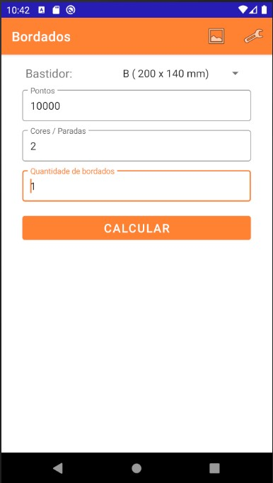

# Projeto Sem nome

Aplicativo android para calculo de valor de bordado partindo da entrada de valores pelo usuário de quantidade de cores e numero de pontos e apresentando uma estimativa de custos e valor minimo que deve ser cobrado.

## Telas

### Inicial

Campos de entrada:

- Tamanho do bastidor;
- Quantidade de cores do bordado;
- Quantidade de pontos da matriz;
- Quantidade de bordados por peça;

### Tela de resultado

- Custo calculado;
  - Mão de obra;
  - Custos de material;
- Preço sugerido;

> Ainda não implementada

### Tela de configuração

- Tempo de bordado
  - Velocidade da maquina
  - tempo de troca de cor
  - tempo de preparação

- Lucro desejado

- Custos de material:
  - Linha bordado
    - Custo do cone
    - Quantidade de linha por cone
    - Consumo de linha por 1000 pontos (6.5)
  - Linha bobina
    - Custo do cone
    - Quantidade de linha por cone
    - Consumo de linha por 1000 pontos (2.5)
  - Entretela
    - Custo (do metro)
    - largura
    - comprimento (sempre 1 metro?)

- Mão de obra (valor da hora trabalhada):
  - Numero de horas trabalhadas (por dia)
  - Numero de dias trabalhados (por mês)
  - Previsão de ganho (Salário, Calculado ou informado)

- Custos fixos:
  - Aluguel
  - Luz
  - Agua
  - Telefone / Internet
  - Manutenção (valor anual)

### Tela CRUD Bastidores

> Em definição

## Tecnologias

- Android:
  - Kotlin
  - SQLite
  - ROOM lib

Ferramentas:

- Android Studio
  - versão minima 4.4
  - versão 10 do android;
